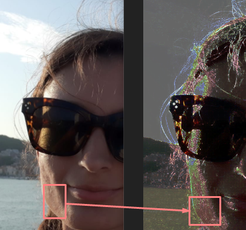

# Uvod
Implementacija NLA algoritma u Pythonu.

## Pokretanje projekta
Program se pokreće pomoću virtualne okoline

```sh
$ py -m venv env
```

### Windows
```sh
$ env/Scripts/Activate.ps1
```

### Linux
```sh
$ source env/scripts/activate 
```

### Deps
Za sve OS-ove:
```sh
$ pip install -r req.txt
```

## Struktura programa
Glavni dio koda nalazi se u `main.py` datoteci. Program koristi vanjski konfiguracijski file pa zbog toga pozivi funkcijama su wrapani tako da se konfiguracijski file primjeni ispravno (ne volim if-else). Zbog toga, `main.py` bit će objašnjen na kraju.

### `config.py`
Ova datoteka osigurava da se konfiguracijski file `config.ini` ispravno primjeni. Sastoji se od ugl pomoćnih funkcija koje nemaju veze sa zadatkom.  
Ako pokrećete algoritam na većim slikama stavite `use_separable` na `False` inače će izvršavanje trajat dugo.  
Objašnjeno je zašto u nastavku.

### `config.ini`
Ovaj file sadrži opcije koje se mogu koristiti. Cilj je bio replicirati što je više moguće Forensically NA algoritam.  

#### Main
Glavni dio konfiguracije sadrži opće stvari poput imena datoteka i sl.

```ini
[main]
image_name = demo7.jpg # Ime početne slike
filtered_image_out = filter_out.png # Ime slike nakon filtriranja
noise_out = noise_out.png # Ime datoteke za spremanje dobivenog šuma
```
Vrijednosti `False` znače da se ne sprema ništa

#### show
Više služi za debugging. Može se odabrati koji korak u algoritmu prikazati, koji ne.

```ini
filtered= Filtered
equal= False
noise= False
blend= Blend
```

Vrijednost su ime prozora (prema dokumentaciji, ali ne radi baš) ili `False`.

#### filter
Postavke filtera. Najbitniji dio konfiguracije.
```ini
equalise = True # True ili False za ujednačavanje histograma
use_grayscale = False # Sivi tonovi ili RGB
use_separable = False # Korištenje Separable Median filtera*
mask_size = 3 # Veličina filter maske
```

Separable median filter je filter koji koristi **Forensically**.  
Radi se o row by row pa column by column 1-D filteru umjesto 2-D box filtera.  
Budući da ne postoji u libu implementiran je ručno [ovdje](#separablemedianfilter).

#### post
Nakon primjene filtera ostaje prikaz rezultat. Amplify će pojačati šum, a bland će prikazati šum preko originalne slike.

```ini
amplify = 5
blend = True
blend_scale = 0.6
blend_out = blend.png
```

### `helper.py`
Unutar ove datoteke nalazi se jezgra programa. Ovdje su implementirani algoritmi za obradu slike.

#### equalise_g
Funkcija radi ujednačavanje histograma i vrši pretvorbu u grayscale.
Razlog je što mi se čini lakše krenut s GS slikom pa preći na RGB.

### equlise_rgb
Objašnjenje funkcije ispod:
```py
def equalise_rgb(image):
    width, height = image.size
    totalPixels = width * height
    r, g, b = image.split()
    channels = [r, g, b]

    for c in channels:
        freq = [0] * 256  # fill
        cProbability = [0] * 256  # fill zeros
        freq = c.histogram()
        prevSum = 0
        for i in range(256):
            # add the probablity to calculate
            prevSum += freq[i]*1.0/totalPixels
            cProbability[i] = prevSum
        channel_pixles = c.load()  # allows the image to be writable

        for x in range(width):
            for y in range(height):
                channel_pixles[x, y] = int(
                    255 * cProbability[channel_pixles[x, y]])
    return Image.merge(image.mode, (r, g, b))
```
Sastoji se od nekoliko jednostavnih koraka:

1) Uzimanje informacija iz slike na početku
2) Za svaki kanal `c` u RGB ponavlja se postupak koji slijedi
3) Za svaku vrijednost pixela od 0 do 255 uzima se njega vrijednost histograma * 1 (u ovom slučaju) i dijeljeno brojem piksela
4) Na ovaj način nastaje novi histogram gdje se za piksel uzima u obzir suma svih vrijednosti originalnog histograma do tog piksela (puta neki faktor i dijeljeno brojem piksela)
5) Novi histogram se primjeni na slici kao `255 * cProbability` za svaki piksel

### SeparableMedianFilter
Slijedi "ručna" implementacija median filtera. Razlika u odnosu na obični median je u redoslijedu primjene filtera.

```py
def SeparableMedianFilter(image, size):
    size = int(size)
    if (size != 3 and size != 9):
        raise "Bad size param! Must be 3 or 9"
    if (size == 9):
        raise "Size 9 not implemented (yet)! Use 3"
    w, h = image.size
    src = image.split()
    channels = list(src)

    for c in channels:
        pixles = c.load()
        for x in range(w):
            for y in range(h):
                pixles[x, y] = _findQuick3x3Median(
                    _getSubArray(pixles, x, y, w, "w"))
    halfImage = Image.merge(image.mode, src)

    src = halfImage.split()
    channels = list(src)
    for c in channels:
        pixles = c.load()
        for y in range(h):
            for x in range(w):
                pixles[x, y] = _findQuick3x3Median(
                    _getSubArray(pixles, x, y, h, "h"))
    return Image.merge(halfImage.mode, src)
```

Filter je implementiran za 1x3 masku. Razlog je taj što je za veće maske jako spor.  
Nadao sam se da će profesor tu pomoć :)

Dvije pomoćne funkcije su _getSubArray:

```py
def _getSubArray(pixels, x, y, dim_size, dim):
    res = []
    if (dim == "w"):
        res.append(pixels[x, y])
        res.append(pixels[x + 1, y] if x + 1 < dim_size else 0)
        res.append(pixels[x + 2, y] if x + 2 < dim_size else 0)
    elif (dim == "h"):
        res.append(pixels[x, y])
        res.append(pixels[x, y + 1] if y + 1 < dim_size else 0)
        res.append(pixels[x, y + 2] if y + 2 < dim_size else 0)
    return res
```

Funkcija dohvaća niz od 3 elementa za svaki piksel nad kojim se onda radi Median operacija.  
Funkcija je napravljena da radi u po dužini ("w") i visini ("h"). Ako je index nekog od 3 piksela van niza uzima se 0.  
To je jedna od implementacija.

Ova funkcija za traženje mediana je zanimljiva:
```py
def _findQuick3x3Median(tuple3):
    a, b, c = tuple3
    mx = max(max(a, b), c)
    mi = min(min(a, b), c)
    return a ^ b ^ c ^ mx ^ mi
```

Zasluge za ovu funkciju idu tvorcu **Forensically** stranice.  
Riječ je o jednostavnom triku sa XOR operacijom.  
Pošto imamo 3 elementa i jedan od njih je najmanji (mi), a drugi najveći (mx) možemo primijeniti reverzibilno svojstvo XOR operacije:
`a XOR b XOR c` daju neki rezultat `abc`. Nakon toga možemo "ukloniti" najmanji element i najveći element koristeći XOR još dva puta.
Nije bitno koji je od `a` ili `b` mi/mx, ako XOR-amo s njima ostaje samo srednji rezultat.  

### Amplify
Funkcija pojačava amplitudu šuma jednostavnim množenjem svakog piksela nekim faktorom.
```py
def amplify(image, factor=1):
    factor = int(factor)
    src = image.split()
    channels = list(src)
    w, h = image.size

    for c in channels:
        pixels = c.load()
        for x in range(w):
            for y in range(h):
                pixel = pixels[x, y]
                if ((pixel * factor) > 255):
                    pixels[x, y] = 255
                else:
                    pixels[x, y] = pixel * factor
    return Image.merge(image.mode, src)
```

## Rezultati
Na slikama za seminar ovaj filter nije bio od velike pomoći. Vjerojatno treba pogoditi amplify faktor.  
Testirao sam algoritam na slici koju sam imao od ranije gdje sam kolegici uklonio bubuljicu na licu.
Algoritam ispravno detektira nedostatak šuma na toj točci:

<p align="center">
  
</p>

